# 🧠 Hybrid Hopfield-SSM Language Model  


**An experimental Hybrid Language Model Architecture Combining State Space Models, Hopfield Networks, and Attention**  
*Built in JAX / Flax for TPU-scale research (and it’s cheaper by hours on Colab)*  
*(And yes, I also use Emojis 🥹)*

---

## 🧩 Overview

This is an end-to-end exploration of a custom language-model architecture inspired by biological computation.  
It evolves from early neuro-symbolic ideas into a performant hybrid system that fuses:

- **State Space Models (SSM)** for efficient long-range sequence processing  
- **Modern Hopfield Networks** for associative memory and robust pattern completion  
- **Causal Self-Attention** for content-based reasoning  

These components are dynamically routed through a learned **Gated Mixer**, guided by a lightweight hierarchical controller (**HRM-lite**) that performs segmented reasoning.  
Training and evaluation were performed from scratch on **WikiText-103** (and *Tiny Shakes*, see early README) at both **word-level** (PPL ≈ 30 @ 25 k steps) and **subword (BPE)** levels (PPL ≈ 35 @ 25 k steps) using **JAX / Flax** on TPUs.

---

## ✨ Key Features

| Capability | Description |
|-------------|-------------|
| **Hybrid Architecture** | Unified block combining SSM, MoR-Hopfield, and Self-Attention. |
| **High Performance** | Validation PPL ≈ 30.3 (word-level WikiText-103, ~107 M params). |
| **Efficient Implementation** | > 60 K tokens / s on TPU v3. |
| **Segmented Reasoning (HRM-lite)** | Two-segment forward loop with a stop-gradient controller bias. |
| **Emergent Component Roles** | Probes show Hopfield is position-sensitive, Attention content-sensitive. |
| **Stable Training** | Rectified Flow regularization, label smoothing, and z-loss prevent collapse. |

---

## Final Architectural Deep Dive (and mermaid graph)

The final model (~107 M params) is an 8-layer decoder-only LM built around a `HybridBlock` that merges three computation paths:

```mermaid
graph TD
    A[Input] --> B[Token Embeddings]
    B --> C[Positional Embedding]
    C --> H[h₀]

    subgraph Segmented_Reasoning
        H --> S1[Segment 1]
        S1 -->|stop_gradient| CTRL[Controller]
        CTRL -->|bias| S2[Segment 2]
    end

    S2 --> LM[LM Head]
    LM --> O[Logits]

    %% Styling
    style A fill:#ffe6ff,stroke:#333,stroke-width:1.5px
    style O fill:#e6f0ff,stroke:#333,stroke-width:1.5px
    style Segmented_Reasoning fill:#fdfdfd,stroke:#999,stroke-width:1px
```



### 1️⃣ Modern SSM (`ModernSSM`)
- Depthwise causal conv prefilter → selective scan (A diag param via log stabilization)  
- Input-dependent gates (`g_in`, `g_forget`) control temporal propagation  
**Role:** Capture long-range dependencies efficiently  

### 2️⃣ Mixture-of-Recursions Hopfield (`MoRHopfield`)
- Performs *K* recursive refinements (K scheduled per layer, e.g. [3, 2, 2, … 1])  
  *(L0 layer proved most impactful after several ablations)*  
- Learns to gate across recursion depths for shallow vs deep recall  
**Role:** Robust pattern completion and associative memory  

### 3️⃣ Causal Self-Attention (`SelfAttention`)
- Standard multi-head attention with causal mask  
**Role:** Content-based pattern mixing within the context window  

### 4️⃣ Gated Mixer (`GatedMixer`)
- Small feed-forward net generating softmax gates over SSM, Hopfield, and Attention outputs  
**Role:** Learned information routing per context  

### 5️⃣ Segmented Reasoner & Controller (`SegmentReasoner`, `HController`)
- Two-segment forward loop; Segment 1 produces a hidden state fed to `HController`, which outputs a bias vector to influence Segment 2’s mixing weights  
- A `stop_gradient` approximates one-step credit assignment  
**Role:** Iterative refinement without explicit RL  

---

## 📊 Performance and Experimental Results

### 🏁 Main Results (WikiText-103 word-level)

| Metric | Value |
|:--|:--|
| Best Validation Cross-Entropy | 3.4424 |
| Best Validation Perplexity | 30.3 |
| Training Steps | 25 000 |
| Parameters | ≈ 107 M |
| Throughput (TPU v3 / Colab) | ≈ 60 K tok/s |

A BPE-tokenized variant (~97 M params) reached PPL ≈ 36.8.

---

## 📈 Training Dynamics

Early byte-level experiments confirmed stable learning curves with steady CE reduction, validating the architecture before scaling to word level.

*(Figure 1 placeholder — Training and Validation CE curves)*

---

## 🔬 Ablation Studies — Importance of Hybridization

| Configuration | Validation CE | Category |
|:--|:--:|:--|
| Full Hybrid Model | 3.60 | Baseline |
| Only SSM | 9.81 | Single Path |
| Only Hopfield | 7.72 | Single Path |
| Only Attention | 9.15 | Single Path |
| SSM + Hopfield | 5.43 | Two Paths |
| SSM + Attention | 9.51 | Two Paths |
| Hopfield + Attention | 7.40 | Two Paths |

**Conclusion:** All three components are necessary; removing any causes a sharp performance drop.

---

## 🧩 Probe Analysis — Component Roles

| Intervention | Validation CE | Observation |
|:--|:--:|:--|
| Baseline (no shuffle) | 3.59 | — |
| Shuffle → Attention | 4.35 | Moderate impact |
| Shuffle → SSM | 6.00 | Strong impact |
| Shuffle → Hopfield | 8.01 | Severe degradation |

**Findings**  
- Hopfield modules encode position-dependent patterns  
- Attention focuses on content irrespective of position  
- SSM balances both, bridging sequential and content signals  

*(Table 2 — Probe Results)*
| Test | Val CE | Category |
|:--|--:|:--|
| baseline | 3.6043 | baseline |
| seg_1 | 3.8902 | segments |
| seg_2 | 3.6136 | segments |
| seg_3 | 3.6043 | segments |
| ctrl_normal | 3.6043 | controller |
| ctrl_shuffle | 3.7270 | controller |
| ctrl_random | 4.1094 | controller |
| no_ctrl | 3.8902 | controller |
| only_ssm | 9.8124 | single_path |
| only_hop | 7.7175 | single_path |
| only_attn | 9.1533 | single_path |
| ssm+hop | 5.4290 | two_path |
| ssm+attn | 9.5113 | two_path |
| hop+attn | 7.4022 | two_path |

---

## 🔄 Project Evolution

| Phase | Focus | Milestone |
|:--|:--|:--|
| 1️⃣ PyTorch Prototype | HippocampalMemoryInterface & Delayed Copy Task | Proof of concept |
| 2️⃣ Component Comparison | Recurrent vs Hopfield CA3 | Hopfield proved superior |
| 3️⃣ Hybridization | Combine SSM + Hopfield + Attention on TinyShakespeare | Stable training |
| 4️⃣ JAX / Flax Migration | TPU performance + byte-level WikiText | Improved efficiency |
| 5️⃣ Scaling | Word-level WikiText-103 (~107 M params) | Final architecture + MoR / HRM-lite |
| 6️⃣ Advanced Concepts | Rectified Flow regularization | Stable long-runs and probes |

---

## ⚙️ Usage

### Setup
```bash
pip install jax flax optax datasets tokenizers

## Training

**Training**

# From training_bpe.py
if __name__ == "__main__":
    train_bpe_level()


## Sampling

import jax, pickle
from tokenizers import Tokenizer
import training_bpe as mdl

with open("path/to/best.ckpt", "rb") as f:
    ckpt = pickle.load(f)
tokenizer = Tokenizer.from_file(ckpt["tokenizer_path"])

prompt = "The history of artificial intelligence began in"
generated = mdl.sample_text(
  state=ckpt['ema_params'],
  base_cfg=ckpt['base_cfg'],
  tokenizer=tokenizer,
  prompt=prompt,
  max_new_tokens=100,
)
print(generated)


## Code Structure

ProjectHippocampus/
├── models/
│   ├── hybrid_lm.py          # HybridLM wrapper
│   ├── hybrid_block.py       # Core HybridBlock
│   ├── modern_ssm.py         # SSM implementation
│   ├── mor_hopfield.py       # Mixture-of-Recursions Hopfield
│   ├── gated_mixer.py        # Learned gating
│   └── controller.py         # HRM-lite controller
├── training/
│   ├── training_bpe.py
│   ├── data.py
│   ├── utils.py
│   └── rectified_flow.py
├── probes/
│   ├── shuffle_probes.py
│   └── results.csv
├── checkpoints/
└── README.md


## Citations

@misc{adam2025hippocampus,
  title  = {Hybrid what? A Hybrid Language Model Architecture},
  author = {Julian Adam},
  year   = {2025},
  note   = {Hybrid SSM + Hopfield + Attention; HRM-lite controller; WikiText-103 word-level PPL ≈ 30.3. (BPE 35)}
}


## License

MIT License — see MIT LICENSE.
---


## 🧾 Changelog
**v1.0 – Oct 2025**
- Initial public release (WikiText-103 word-level PPL ≈ 30.3)
- Added probes and ablation tables
- Added segmented reasoning diagram
- Still need to add the code, its still one huge monolith across a few jupyter cells and .py's lol

